# local-collage

**Your iPhone took a better photo than any collage app let you share.**

<video src="docs/demo.mp4" poster="docs/demo-poster.jpg" controls width="100%"></video>

---

## The problem

When you drop iPhone photos into an online collage tool:

- Your files **upload to a stranger's server** you don't control
- HEIC is quietly converted to JPEG — a **lossy, sRGB round trip**
- **Display P3 wide color is clipped** — the vivid colors iPhone captured are gone
- **HDR gain maps are discarded** — highlights become flat
- You get back a duller, smaller-gamut copy of your own photos

You took a great photo. The collage tool made it worse before you even started.

## The fix

local-collage keeps the entire pipeline on your Mac.

- **HEIC stays HEIC.** Photos are decoded natively in Display P3 (via libheif), composited in P3, and re-encoded once. No JPEG round trip, so the "pop" survives.
- **HDR is kept.** iPhone HDR gain maps carry through to Ultra HDR JPEG or Apple HDR HEIC export. Highlights glow on HDR screens. Standard viewers just see the normal SDR image.
- **Zero uploads.** Photos never leave your machine. The server binds to `127.0.0.1` only.
- **Mix anything.** HEIC, JPEG, PNG, TIFF, WebP, AVIF, plus MOV/MP4 — including iPhone HDR/HLG video.
- **Videos play inside their tile.** A collage with clips exports as a video.
- **Layouts for 1–10 tiles:** Auto layout (minimizes cropping), 106 templates, draggable dividers, freeform mode.
- **Style controls:** Canvas format (1:1, 4:5, 9:16, 16:9, print sizes, A-series, custom), sharp/rounded/circle tiles, spacing and border sliders, padding color by picker, hex code, or swatch.

---

## Quick start

```sh
./start.sh
```

Opens `http://127.0.0.1:5173`. The first run creates a Python venv and installs Flask, Pillow, pillow-heif, numpy, and (on macOS) PyObjC Quartz. Needs Python 3 and `ffmpeg`:

```sh
brew install ffmpeg
```

Xcode is not required. Exports go to `exports/`, imported media lives in `workspace/`.

---

## Using it

| Action | How |
| --- | --- |
| Add media | Drop files onto the window, or click **Add files**. Click a library item to add it |
| Reposition a photo in its tile | Drag inside the tile |
| Zoom | Scroll or pinch on the tile, or use the Zoom slider |
| Resize cells | Drag the gap between tiles |
| Swap two tiles | Drag a tile's ⠿ handle onto another tile |
| Replace a tile | Drag a library item onto it |
| Free a tile | Click ⧉ on the tile (or switch to Freeform mode for all tiles). Then drag to move, use the corner handle to resize (⇧ = free aspect) and the top handle to rotate (⇧ = 15° steps). ⌥-drag pans the photo |
| Change format / shape / padding | Right panel, at any time. A new collage asks for these first |
| Undo / redo | ⌘Z / ⇧⌘Z |
| Play videos | Space, or the transport bar under the canvas |

## Export formats

| Format | Color | Notes |
| --- | --- | --- |
| JPEG Display P3 + HDR gain map | P3 + HDR | Ultra HDR JPEG. iPhone HDR highlights glow on HDR screens; other viewers show the normal image. Default when the collage contains HDR photos |
| HEIC Display P3 + HDR gain map | P3 + HDR | Apple's own iPhone HDR format, written by macOS ImageIO |
| JPEG Display P3 | P3 | Recommended for photos without HDR. Wide color, opens everywhere |
| HEIC Display P3 | P3 | Smallest files, Apple-native |
| PNG / TIFF Display P3 | P3 | Lossless |
| JPEG / PNG sRGB | sRGB | Maximum compatibility; colors outside sRGB are clipped |
| MP4 H.264 | BT.709 | For Instagram, WhatsApp, web |
| MOV HEVC 10-bit | Display P3 | Wide-color video for Apple devices |
| MOV HEVC 10-bit HDR | HLG BT.2020 | HDR clips stay HDR and photo gain maps carry over. SDR content sits at 203 nits (BT.2408) |

---

## Contents (technical reference)

1. [Architecture](#architecture)
2. [Data model](#data-model)
3. [Workflows (sequence diagrams)](#workflows)
4. [Algorithms](#algorithms)
   - [Layout tree and geometry](#71-layout-tree-and-geometry)
   - [Template generation](#72-template-generation)
   - [Auto layout](#73-auto-layout)
   - [Placement: crop, pan, zoom](#74-placement-crop-pan-zoom)
   - [Tile shapes and masks](#75-tile-shapes-and-masks)
   - [Color management for photos](#76-color-management-for-photos)
   - [Video color and HDR tone mapping (BT.2446 Method A)](#77-video-color-and-hdr-tone-mapping)
   - [HDR gain maps](#78-hdr-gain-maps)
   - [Ultra HDR JPEG file layout](#79-ultra-hdr-jpeg-file-layout)
   - [Video export pipeline](#710-video-export-pipeline)
   - [Frame-accurate looping](#711-frame-accurate-looping)
   - [Preview playback sync](#712-preview-playback-sync)
   - [Undo / redo history](#713-undo--redo-history)
5. [Security model](#security-model)
6. [HTTP API](#http-api)
7. [Project layout](#project-layout)
8. [How it was verified](#how-it-was-verified)
9. [Known limits](#known-limits)

---

## Architecture

### System overview

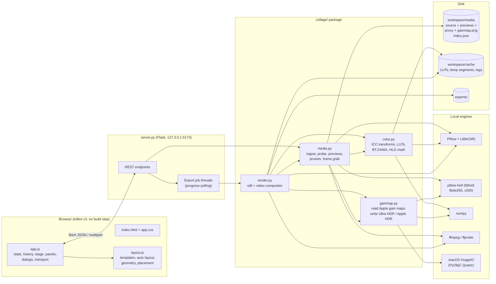
```mermaid
flowchart LR
    subgraph Browser["Browser (editor UI, no build step)"]
        HTML["index.html + app.css"]
        APP["app.js<br/>state, history, stage, panels,<br/>dialogs, transport"]
        LAY["layout.js<br/>templates, auto layout,<br/>geometry, placement"]
        APP --> LAY
    end

    subgraph Server["server.py (Flask, 127.0.0.1:5173)"]
        API["REST endpoints"]
        JOBS["Export job threads<br/>(progress polling)"]
    end

    subgraph Core["collage/ package"]
        MEDIA["media.py<br/>ingest, probe, previews,<br/>proxies, frame grab"]
        COLOR["color.py<br/>ICC transforms, LUTs,<br/>BT.2446A, HLG math"]
        RENDER["render.py<br/>still + video compositor"]
        GAIN["gainmap.py<br/>read Apple gain maps,<br/>write Ultra HDR / Apple HDR"]
    end

    subgraph Tools["Local engines"]
        PIL["Pillow + LittleCMS"]
        HEIF["pillow-heif (libheif,<br/>libde265, x265)"]
        NP["numpy"]
        FF["ffmpeg / ffprobe"]
        IIO["macOS ImageIO<br/>(PyObjC Quartz)"]
    end

    subgraph Disk["Disk"]
        WS[("workspace/media<br/>source + previews +<br/>proxy + gainmap.png<br/>index.json")]
        CACHE[("workspace/cache<br/>LUTs, temp segments, logs")]
        EXP[("exports/")]
    end

    APP <-->|"fetch JSON / multipart"| API
    API --> MEDIA
    API --> JOBS
    JOBS --> RENDER
    RENDER --> COLOR
    RENDER --> GAIN
    RENDER --> MEDIA
    MEDIA --> COLOR
    MEDIA --> GAIN
    MEDIA --> PIL
    MEDIA --> HEIF
    MEDIA --> FF
    COLOR --> PIL
    COLOR --> NP
    GAIN --> HEIF
    GAIN --> NP
    GAIN --> IIO
    RENDER --> FF
    RENDER --> PIL
    MEDIA --> WS
    COLOR --> CACHE
    RENDER --> CACHE
    RENDER --> EXP
```

### Module dependencies

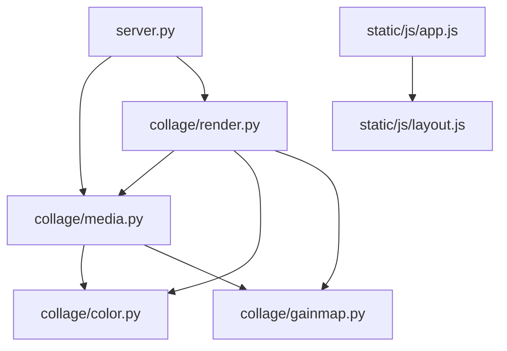
```mermaid
flowchart TD
    server["server.py"] --> media["collage/media.py"]
    server --> render["collage/render.py"]
    render --> media
    render --> color["collage/color.py"]
    render --> gainmap["collage/gainmap.py"]
    media --> color
    media --> gainmap
    appjs["static/js/app.js"] --> layoutjs["static/js/layout.js"]
```

### Responsibility split

The browser does all layout math and sends the server **final, normalized tile rectangles**. The server never re-runs the layout, so an export can't drift from what the editor shows.

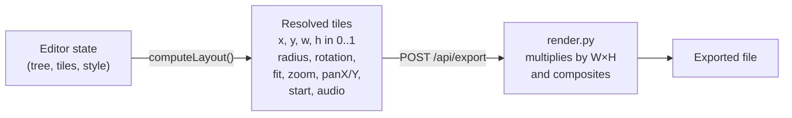
```mermaid
flowchart LR
    S["Editor state<br/>(tree, tiles, style)"] -->|"computeLayout()"| R["Resolved tiles<br/>x, y, w, h in 0..1<br/>radius, rotation,<br/>fit, zoom, panX/Y,<br/>start, audio"]
    R -->|"POST /api/export"| X["render.py<br/>multiplies by W×H<br/>and composites"]
    X --> O["Exported file"]
```

---

## Data model

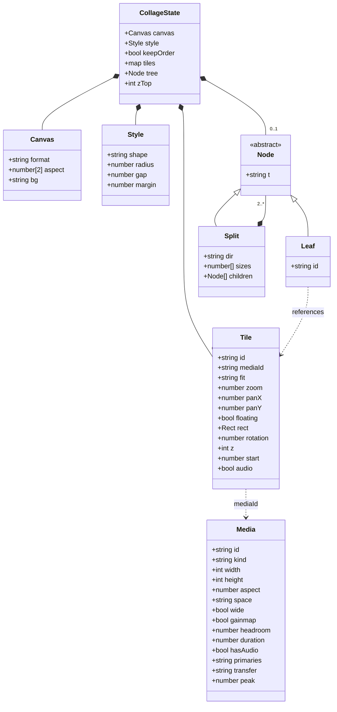
```mermaid
classDiagram
    class CollageState {
        +Canvas canvas
        +Style style
        +bool keepOrder
        +map tiles
        +Node tree
        +int zTop
    }
    class Canvas {
        +string format
        +number[2] aspect
        +string bg
    }
    class Style {
        +string shape
        +number radius
        +number gap
        +number margin
    }
    class Tile {
        +string id
        +string mediaId
        +string fit
        +number zoom
        +number panX
        +number panY
        +bool floating
        +Rect rect
        +number rotation
        +int z
        +number start
        +bool audio
    }
    class Node {
        <<abstract>>
        +string t
    }
    class Leaf {
        +string id
    }
    class Split {
        +string dir
        +number[] sizes
        +Node[] children
    }
    class Media {
        +string id
        +string kind
        +int width
        +int height
        +number aspect
        +string space
        +bool wide
        +bool gainmap
        +number headroom
        +number duration
        +bool hasAudio
        +string primaries
        +string transfer
        +number peak
    }
    CollageState *-- Canvas
    CollageState *-- Style
    CollageState *-- "0..10" Tile
    CollageState *-- "0..1" Node
    Node <|-- Leaf
    Node <|-- Split
    Split *-- "2..*" Node
    Leaf ..> Tile : references
    Tile ..> Media : mediaId
```

| Field | Values |
| --- | --- |
| `Style.shape` | `sharp`, `rounded`, `circle` |
| `Style.radius`, `gap`, `margin` | fraction of the canvas short edge |
| `Tile.fit` | `cover` (fill cell) or `contain` (show whole) |
| `Tile.panX`, `panY` | −1 … 1, fraction of the available slack |
| `Tile.rect` | normalized `{x, y, w, h}`, floating tiles only |
| `Tile.start` | video in-point, seconds |
| `Split.dir` | `row` (side by side) or `col` (stacked) |
| `Media.transfer` | `sdr`, `hlg`, `pq` |

On disk, each imported file gets its own folder:

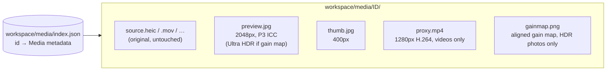
```mermaid
flowchart LR
    IDX[("workspace/media/index.json<br/>id → Media metadata")]
    subgraph Folder["workspace/media/ID/"]
        SRC["source.heic / .mov / …<br/>(original, untouched)"]
        PRE["preview.jpg<br/>2048px, P3 ICC<br/>(Ultra HDR if gain map)"]
        TH["thumb.jpg<br/>400px"]
        PX["proxy.mp4<br/>1280px H.264, videos only"]
        GM["gainmap.png<br/>aligned gain map, HDR photos only"]
    end
    IDX --> Folder
```

---

## Workflows

### App start and first run

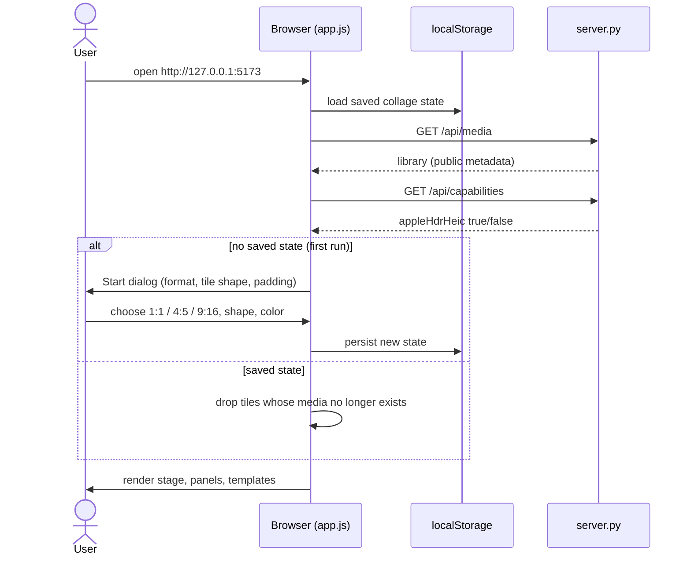
```mermaid
sequenceDiagram
    actor U as User
    participant B as Browser (app.js)
    participant LS as localStorage
    participant S as server.py
    U->>B: open http://127.0.0.1:5173
    B->>LS: load saved collage state
    B->>S: GET /api/media
    S-->>B: library (public metadata)
    B->>S: GET /api/capabilities
    S-->>B: appleHdrHeic true/false
    alt no saved state (first run)
        B->>U: Start dialog (format, tile shape, padding)
        U->>B: choose 1:1 / 4:5 / 9:16, shape, color
        B->>LS: persist new state
    else saved state
        B->>B: drop tiles whose media no longer exists
    end
    B->>U: render stage, panels, templates
```

### Importing media

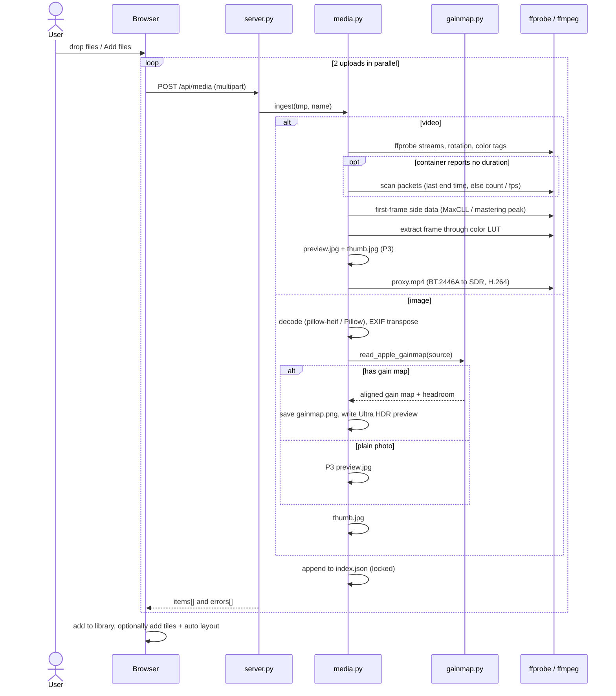
```mermaid
sequenceDiagram
    actor U as User
    participant B as Browser
    participant S as server.py
    participant M as media.py
    participant G as gainmap.py
    participant FF as ffprobe / ffmpeg
    U->>B: drop files / Add files
    loop 2 uploads in parallel
        B->>S: POST /api/media (multipart)
        S->>M: ingest(tmp, name)
        alt video
            M->>FF: ffprobe streams, rotation, color tags
            opt container reports no duration
                M->>FF: scan packets (last end time, else count / fps)
            end
            M->>FF: first-frame side data (MaxCLL / mastering peak)
            M->>FF: extract frame through color LUT
            M->>M: preview.jpg + thumb.jpg (P3)
            M->>FF: proxy.mp4 (BT.2446A to SDR, H.264)
        else image
            M->>M: decode (pillow-heif / Pillow), EXIF transpose
            M->>G: read_apple_gainmap(source)
            alt has gain map
                G-->>M: aligned gain map + headroom
                M->>M: save gainmap.png, write Ultra HDR preview
            else plain photo
                M->>M: P3 preview.jpg
            end
            M->>M: thumb.jpg
        end
        M->>M: append to index.json (locked)
        S-->>B: items[] and errors[]
    end
    B->>B: add to library, optionally add tiles + auto layout
```

### Editing gestures

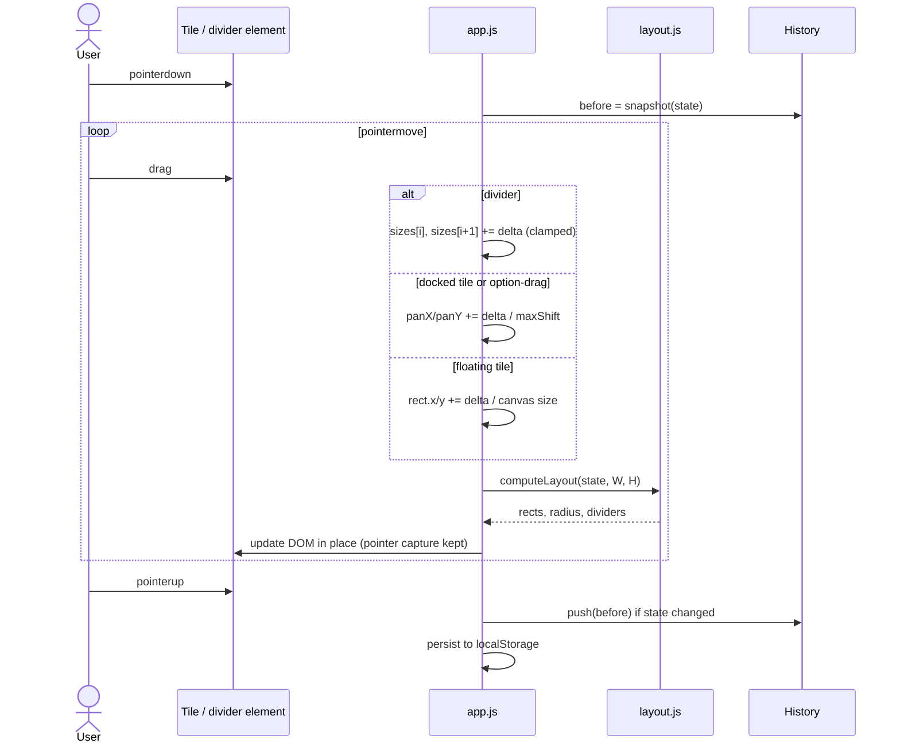
```mermaid
sequenceDiagram
    actor U as User
    participant T as Tile / divider element
    participant A as app.js
    participant L as layout.js
    participant H as History
    U->>T: pointerdown
    A->>H: before = snapshot(state)
    loop pointermove
        U->>T: drag
        alt divider
            A->>A: sizes[i], sizes[i+1] += delta (clamped)
        else docked tile or option-drag
            A->>A: panX/panY += delta / maxShift
        else floating tile
            A->>A: rect.x/y += delta / canvas size
        end
        A->>L: computeLayout(state, W, H)
        L-->>A: rects, radius, dividers
        A->>T: update DOM in place (pointer capture kept)
    end
    U->>T: pointerup
    A->>H: push(before) if state changed
    A->>A: persist to localStorage
```

### Exporting a still

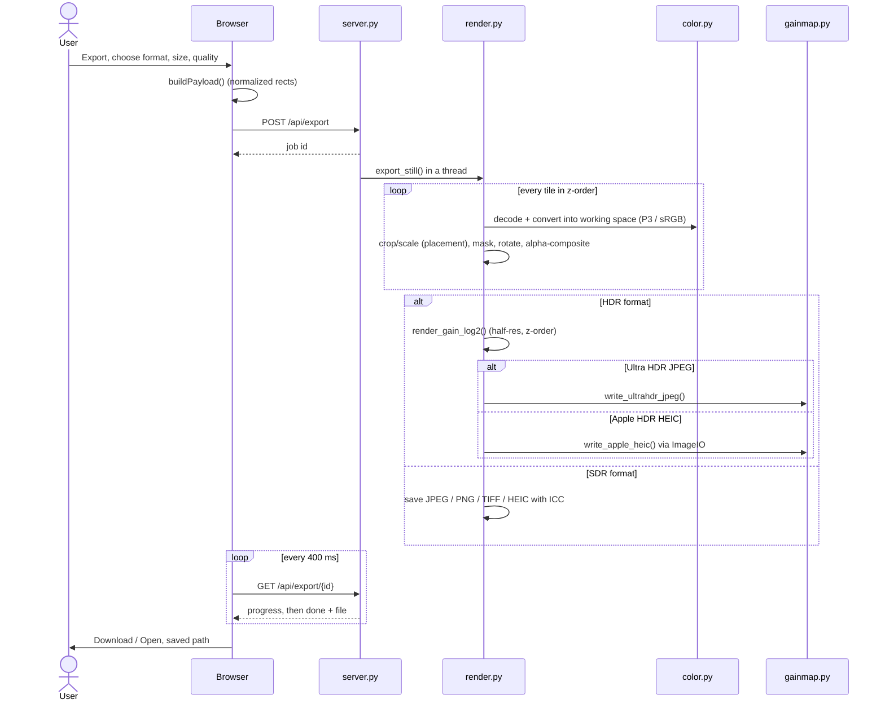
```mermaid
sequenceDiagram
    actor U as User
    participant B as Browser
    participant S as server.py
    participant R as render.py
    participant C as color.py
    participant G as gainmap.py
    U->>B: Export, choose format, size, quality
    B->>B: buildPayload() (normalized rects)
    B->>S: POST /api/export
    S-->>B: job id
    S->>R: export_still() in a thread
    loop every tile in z-order
        R->>C: decode + convert into working space (P3 / sRGB)
        R->>R: crop/scale (placement), mask, rotate, alpha-composite
    end
    alt HDR format
        R->>R: render_gain_log2() (half-res, z-order)
        alt Ultra HDR JPEG
            R->>G: write_ultrahdr_jpeg()
        else Apple HDR HEIC
            R->>G: write_apple_heic() via ImageIO
        end
    else SDR format
        R->>R: save JPEG / PNG / TIFF / HEIC with ICC
    end
    loop every 400 ms
        B->>S: GET /api/export/{id}
        S-->>B: progress, then done + file
    end
    B->>U: Download / Open, saved path
```

### Exporting a video

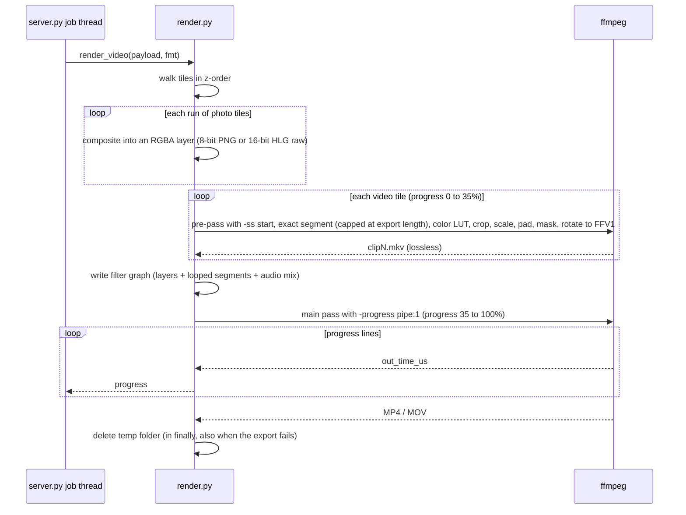
```mermaid
sequenceDiagram
    participant S as server.py job thread
    participant R as render.py
    participant FF as ffmpeg
    S->>R: render_video(payload, fmt)
    R->>R: walk tiles in z-order
    loop each run of photo tiles
        R->>R: composite into an RGBA layer (8-bit PNG or 16-bit HLG raw)
    end
    loop each video tile (progress 0 to 35%)
        R->>FF: pre-pass with -ss start, exact segment (capped at export length), color LUT, crop, scale, pad, mask, rotate to FFV1
        FF-->>R: clipN.mkv (lossless)
    end
    R->>R: write filter graph (layers + looped segments + audio mix)
    R->>FF: main pass with -progress pipe:1 (progress 35 to 100%)
    loop progress lines
        FF-->>R: out_time_us
        R-->>S: progress
    end
    FF-->>R: MP4 / MOV
    R->>R: delete temp folder (in finally, also when the export fails)
```

### Export job lifecycle

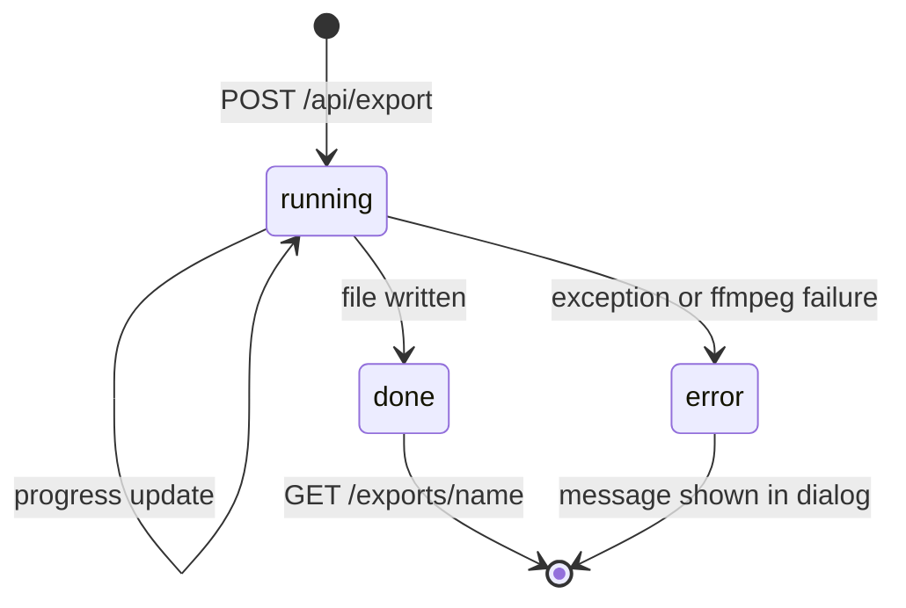
```mermaid
stateDiagram-v2
    [*] --> running: POST /api/export
    running --> running: progress update
    running --> done: file written
    running --> error: exception or ffmpeg failure
    done --> [*]: GET /exports/name
    error --> [*]: message shown in dialog
```

### Editor UI states

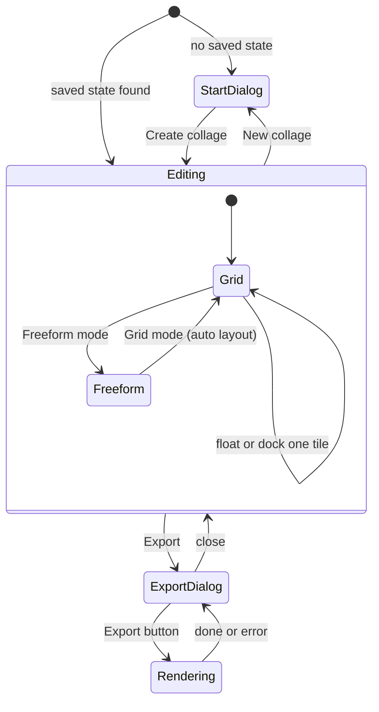
```mermaid
stateDiagram-v2
    [*] --> StartDialog: no saved state
    [*] --> Editing: saved state found
    StartDialog --> Editing: Create collage
    Editing --> StartDialog: New collage
    Editing --> ExportDialog: Export
    ExportDialog --> Rendering: Export button
    Rendering --> ExportDialog: done or error
    ExportDialog --> Editing: close
    state Editing {
        [*] --> Grid
        Grid --> Freeform: Freeform mode
        Freeform --> Grid: Grid mode (auto layout)
        Grid --> Grid: float or dock one tile
    }
```

---

## Algorithms

### 7.1 Layout tree and geometry

Docked tiles form a **guillotine tree**. A `split` divides its rectangle along one axis (`row` = side by side, `col` = stacked) in proportion to `sizes`, and every leaf is one tile. Floating tiles live outside the tree with their own normalized rect and rotation, and are drawn above it in `z` order.

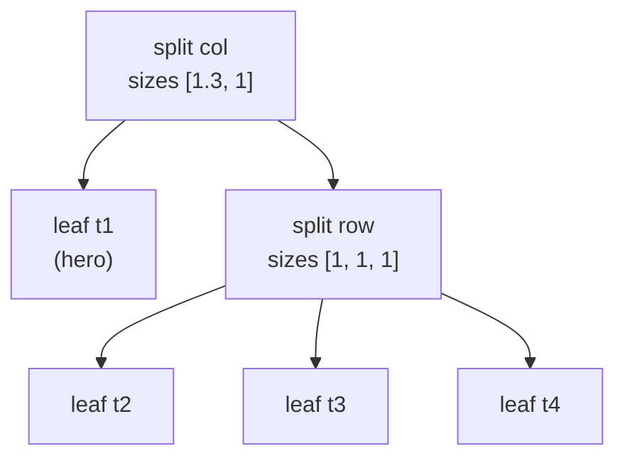
```mermaid
flowchart TD
    ROOT["split col<br/>sizes [1.3, 1]"] --> A["leaf t1<br/>(hero)"]
    ROOT --> ROW["split row<br/>sizes [1, 1, 1]"]
    ROW --> B["leaf t2"]
    ROW --> C["leaf t3"]
    ROW --> D["leaf t4"]
```

`computeLayout(state, W, H)`:

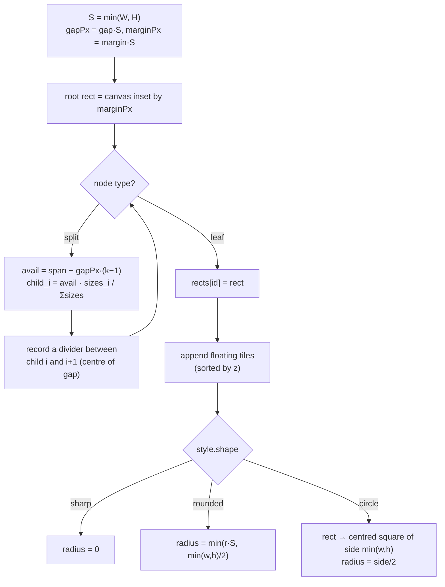
```mermaid
flowchart TD
    A["S = min(W, H)<br/>gapPx = gap·S, marginPx = margin·S"] --> B["root rect = canvas inset by marginPx"]
    B --> C{"node type?"}
    C -->|leaf| D["rects[id] = rect"]
    C -->|split| E["avail = span − gapPx·(k−1)<br/>child_i = avail · sizes_i / Σsizes"]
    E --> F["record a divider between<br/>child i and i+1 (centre of gap)"]
    F --> C
    D --> G["append floating tiles<br/>(sorted by z)"]
    G --> H{"style.shape"}
    H -->|sharp| I["radius = 0"]
    H -->|rounded| J["radius = min(r·S, min(w,h)/2)"]
    H -->|circle| K["rect → centred square of side min(w,h)<br/>radius = side/2"]
```

Dragging a divider moves size between the two neighbours only (`sizes[i] + sizes[i+1]` stays constant) and keeps each side above a minimum share.

### 7.2 Template generation

For `n` tiles, `templates(n)` enumerates layouts and removes duplicates:

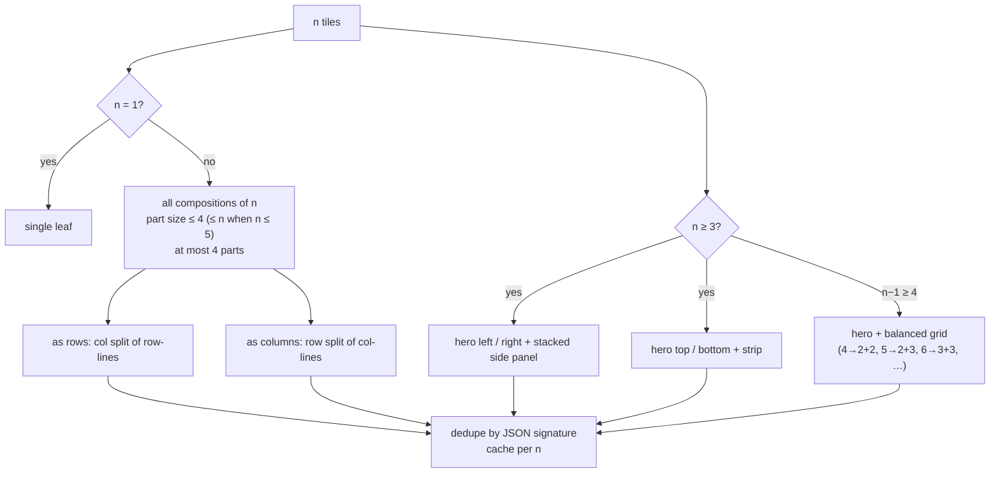
```mermaid
flowchart TD
    N["n tiles"] --> ONE{"n = 1?"}
    ONE -->|yes| L1["single leaf"]
    ONE -->|no| COMP["all compositions of n<br/>part size ≤ 4 (≤ n when n ≤ 5)<br/>at most 4 parts"]
    COMP --> ROWS["as rows: col split of row-lines"]
    COMP --> COLS["as columns: row split of col-lines"]
    N --> HERO{"n ≥ 3?"}
    HERO -->|yes| H1["hero left / right + stacked side panel"]
    HERO -->|yes| H2["hero top / bottom + strip"]
    HERO -->|"n−1 ≥ 4"| H3["hero + balanced grid<br/>(4→2+2, 5→2+3, 6→3+3, …)"]
    ROWS --> DEDUP["dedupe by JSON signature<br/>cache per n"]
    COLS --> DEDUP
    H1 --> DEDUP
    H2 --> DEDUP
    H3 --> DEDUP
```

| n | 1 | 2 | 3 | 4 | 5 | 6 | 7 | 8 | 9 | 10 |
|---|---|---|---|---|---|---|---|---|---|---|
| templates | 1 | 2 | 10 | 18 | 36 | 52 | 74 | 94 | 106 | 106 |

### 7.3 Auto layout

Auto layout searches **template × tile order** for the arrangement that needs the least cropping, while keeping cell sizes reasonably even.

**Natural sizes (`fitSizes`).** Each subtree gets the sizes at which every photo shows uncropped (a justified layout), and the function returns that subtree's natural aspect ratio:

```
leaf:          a = media aspect (w / h)
row split:     sizes_i = a_i            A = Σ a_i
col split:     sizes_i = 1 / a_i        A = 1 / Σ (1 / a_i)
```

**Cost** of a candidate, where `C` is the canvas aspect and `area_i` is each leaf's share of the canvas:

```
cost = 1.6 · |ln(A / C)|  +  0.45 · stddev(ln area_i)
        ↑ crop needed to fit     ↑ penalty for tiny / huge cells
```

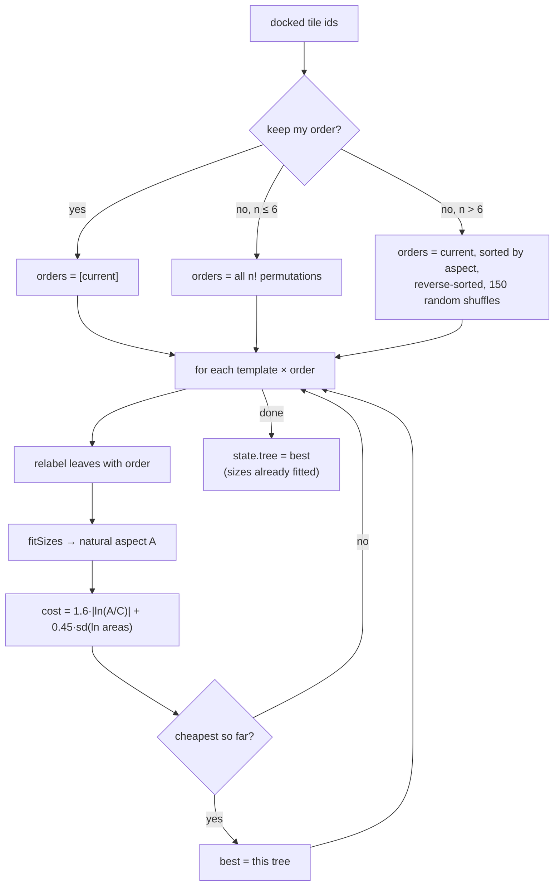
```mermaid
flowchart TD
    A["docked tile ids"] --> K{"keep my order?"}
    K -->|yes| O1["orders = [current]"]
    K -->|"no, n ≤ 6"| O2["orders = all n! permutations"]
    K -->|"no, n > 6"| O3["orders = current, sorted by aspect,<br/>reverse-sorted, 150 random shuffles"]
    O1 --> LOOP
    O2 --> LOOP
    O3 --> LOOP
    LOOP["for each template × order"] --> R["relabel leaves with order"]
    R --> F["fitSizes → natural aspect A"]
    F --> S["cost = 1.6·|ln(A/C)| + 0.45·sd(ln areas)"]
    S --> B{"cheapest so far?"}
    B -->|yes| KEEP["best = this tree"]
    B -->|no| LOOP
    KEEP --> LOOP
    LOOP -->|done| OUT["state.tree = best<br/>(sizes already fitted)"]
```

For 10 tiles this evaluates about 106 × 153 ≈ 16k candidates in about 50 ms. The template gallery uses the same cost to rank the layouts and marks the cheapest one **BEST**. **Fit canvas to photos** sets the canvas aspect to `A`, so nothing is cropped at all.

### 7.4 Placement: crop, pan, zoom

The same function exists in `layout.js` and `render.py`, so the preview and the export match pixel for pixel:

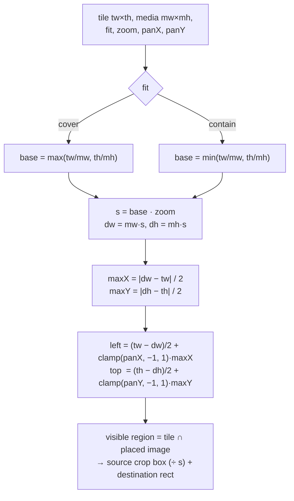
```mermaid
flowchart TD
    I["tile tw×th, media mw×mh,<br/>fit, zoom, panX, panY"] --> F{"fit"}
    F -->|cover| C["base = max(tw/mw, th/mh)"]
    F -->|contain| D["base = min(tw/mw, th/mh)"]
    C --> S["s = base · zoom<br/>dw = mw·s, dh = mh·s"]
    D --> S
    S --> M["maxX = |dw − tw| / 2<br/>maxY = |dh − th| / 2"]
    M --> P["left = (tw − dw)/2 + clamp(panX, −1, 1)·maxX<br/>top  = (th − dh)/2 + clamp(panY, −1, 1)·maxY"]
    P --> V["visible region = tile ∩ placed image<br/>→ source crop box (÷ s) + destination rect"]
```

Pan is stored as a **fraction of the available slack** (−1 to 1), not in pixels, so it doesn't depend on resolution. Dragging by `d` pixels changes pan by `d / maxX`. For floating tiles that are rotated, the drag is first rotated into the tile's own axes.

### 7.5 Tile shapes and masks

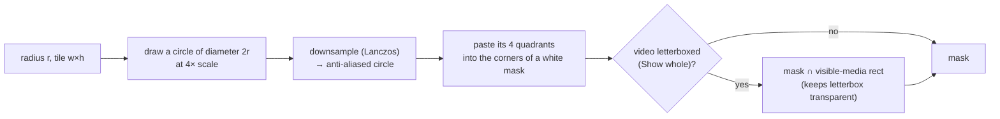
```mermaid
flowchart LR
    R["radius r, tile w×h"] --> Q["draw a circle of diameter 2r<br/>at 4× scale"]
    Q --> D["downsample (Lanczos)<br/>→ anti-aliased circle"]
    D --> P["paste its 4 quadrants<br/>into the corners of a white mask"]
    P --> V{"video letterboxed<br/>(Show whole)?"}
    V -->|yes| X["mask ∩ visible-media rect<br/>(keeps letterbox transparent)"]
    V -->|no| OUT["mask"]
    X --> OUT
```

Only the four corners are supersampled, so even very large tiles mask quickly. Circle tiles are squares with `r = side/2`. Rotated tiles get 2 px of transparent padding before the bicubic rotation, so their edges come out anti-aliased.

### 7.6 Color management for photos

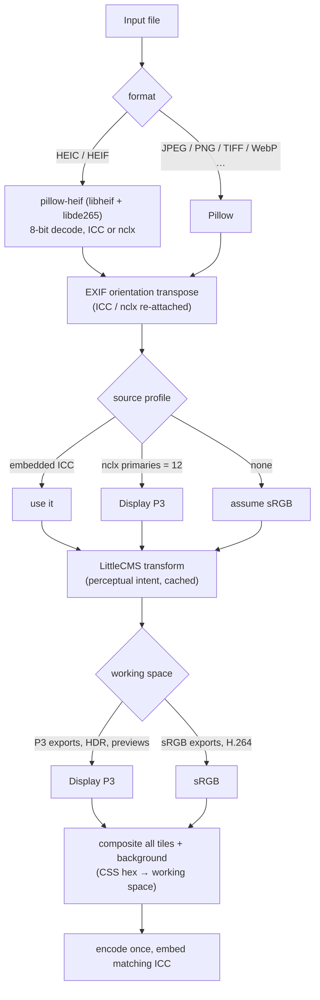
```mermaid
flowchart TD
    IN["Input file"] --> DEC{"format"}
    DEC -->|"HEIC / HEIF"| H["pillow-heif (libheif + libde265)<br/>8-bit decode, ICC or nclx"]
    DEC -->|"JPEG / PNG / TIFF / WebP …"| P["Pillow"]
    H --> EX["EXIF orientation transpose<br/>(ICC / nclx re-attached)"]
    P --> EX
    EX --> SRC{"source profile"}
    SRC -->|"embedded ICC"| ICC["use it"]
    SRC -->|"nclx primaries = 12"| NCLX["Display P3"]
    SRC -->|"none"| SR["assume sRGB"]
    ICC --> T["LittleCMS transform<br/>(perceptual intent, cached)"]
    NCLX --> T
    SR --> T
    T --> WS{"working space"}
    WS -->|"P3 exports, HDR, previews"| P3["Display P3"]
    WS -->|"sRGB exports, H.264"| S["sRGB"]
    P3 --> COMP["composite all tiles + background<br/>(CSS hex → working space)"]
    S --> COMP
    COMP --> OUT["encode once, embed matching ICC"]
```

Previews are P3 JPEGs with an embedded ICC, so color-managed browsers show the wide gamut in the editor too.

### 7.7 Video color and HDR tone mapping

This ffmpeg build has no `zscale`, so all color conversion runs through a **3D LUT that numpy generates locally** (`.cube`, 33³ for SDR and 65³ for HDR, cached per primaries/transfer/peak/target). ffmpeg applies it with `lut3d` (tetrahedral interpolation) on 16-bit RGB.

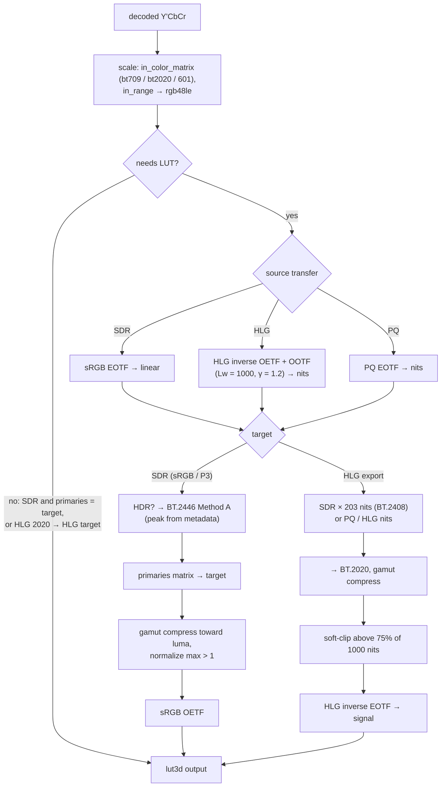
```mermaid
flowchart TD
    V["decoded Y'CbCr"] --> RGB["scale: in_color_matrix (bt709 / bt2020 / 601),<br/>in_range → rgb48le"]
    RGB --> NEED{"needs LUT?"}
    NEED -->|"no: SDR and primaries = target,<br/>or HLG 2020 → HLG target"| OUT
    NEED -->|yes| SRC{"source transfer"}
    SRC -->|SDR| SDR["sRGB EOTF → linear"]
    SRC -->|HLG| HLG["HLG inverse OETF + OOTF<br/>(Lw = 1000, γ = 1.2) → nits"]
    SRC -->|PQ| PQ["PQ EOTF → nits"]
    SDR --> TGT{"target"}
    HLG --> TGT
    PQ --> TGT
    TGT -->|"SDR (sRGB / P3)"| TM["HDR? → BT.2446 Method A<br/>(peak from metadata)"]
    TM --> MAT["primaries matrix → target"]
    MAT --> GC["gamut compress toward luma,<br/>normalize max > 1"]
    GC --> ENC["sRGB OETF"]
    TGT -->|"HLG export"| N2["SDR × 203 nits (BT.2408)<br/>or PQ / HLG nits"]
    N2 --> M2["→ BT.2020, gamut compress"]
    M2 --> PK["soft-clip above 75% of 1000 nits"]
    PK --> HO["HLG inverse EOTF → signal"]
    ENC --> OUT["lut3d output"]
    HO --> OUT
```

**HDR peak** (`L_HDR`): for PQ it's MaxCLL, else the mastering display's max luminance, read from the stream and then the first frame and clamped to 400–10000 nits. Without either it defaults to 1000. HLG always uses its nominal 1000 nits.

**ITU-R BT.2446-1 Method A** (`color.bt2446a`), applied to BT.2020 display light:

```mermaid
flowchart TD
    A["R'G'B' = (nits / L_HDR)^(1/2.4)"] --> B["Y' = 0.2627 R' + 0.6780 G' + 0.0593 B'"]
    B --> C["ρ_HDR = 1 + 32·(L_HDR/10000)^(1/2.4)<br/>Y'p = ln(1 + (ρ_HDR − 1)·Y') / ln ρ_HDR"]
    C --> D{"Y'p"}
    D -->|"≤ 0.7399"| D1["Y'c = 1.0770·Y'p"]
    D -->|"< 0.9909"| D2["Y'c = −1.1510·Y'p² + 2.7811·Y'p − 0.6302"]
    D -->|"else"| D3["Y'c = 0.5·Y'p + 0.5"]
    D1 --> E
    D2 --> E
    D3 --> E["ρ_SDR = 1 + 32·(100/10000)^(1/2.4)<br/>Y'sdr = (ρ_SDR^Y'c − 1) / (ρ_SDR − 1)"]
    E --> F["f = Y'sdr / (1.1·Y')<br/>Cb = f·(B' − Y')/1.8814,  Cr = f·(R' − Y')/1.4746"]
    F --> G["Y'tmo = Y'sdr − max(0.1·Cr, 0)"]
    G --> H["R' = Y'tmo + 1.4746 Cr<br/>B' = Y'tmo + 1.8814 Cb<br/>G' = (Y'tmo − 0.2627 R' − 0.0593 B') / 0.6780"]
    H --> I["linear SDR = clip(R'G'B')^2.4<br/>(1.0 = 100-nit SDR white)"]
```

Reference points for HLG: 0 → 0, HLG 0.75 (203 nits, reference white) → SDR signal 0.67, HLG 1.0 (1000 nits) → 1.0.

### 7.8 HDR gain maps

An iPhone HEIC stores an SDR photo plus a gray **gain map** (auxiliary image `urn:com:apple:photo:2020:aux:hdrgainmap`) and a **headroom** `H`. Apple's rendering rule, confirmed against macOS ImageIO's own HDR decode:

```
HDR_linear = SDR_linear × (1 + (H − 1) × srgb_eotf(gain / 255))
```

**Reading** (`gainmap.read_apple_gainmap`):

```mermaid
flowchart TD
    A["open_heif → info.aux"] --> B{"Apple gain map aux?"}
    B -->|no| NONE["no HDR"]
    B -->|yes| C["gain map image (gray)"]
    C --> D{"aspect vs photo"}
    D -->|same| E1["candidates: 0°, 180°"]
    D -->|swapped| E2["candidates: 90°, 270°"]
    D -->|neither| NONE
    E1 --> F["pick candidate with highest correlation<br/>to the photo's luminance (64×64)"]
    E2 --> F
    F --> G["apply the same EXIF transpose as the photo"]
    G --> HR{"headroom source"}
    HR -->|"XMP HDRGainMap:HDRGainMapHeadroom"| H1["use it"]
    HR -->|"Apple maker note tags 33 / 48"| H2["Apple formula"]
    HR -->|"neither"| H3["default 4.0"]
```

Apple's maker-note formula for older files:

```
if tag33 < 1:  stops = (tag48 ≤ 0.01) ? −20·tag48 + 1.8 : −0.101·tag48 + 1.601
else:          stops = (tag48 ≤ 0.01) ? −70·tag48 + 3.0 : −0.303·tag48 + 2.303
H = 2^max(stops, 0)
```

**Compositing a collage gain map** (`render._gain_log2`). Tiles can have different headrooms, so the boost is blended as `log2(boost)`. Tiles without a gain map write `0`, so they correctly cancel HDR from photos underneath them.

```mermaid
flowchart TD
    A["half-res canvas, log2 boost = 0"] --> L["for each tile in z-order"]
    L --> S{"media has gain map?"}
    S -->|yes| G["source = gainmap.png"]
    S -->|no| Z["source = tiny black image<br/>with the media's aspect"]
    G --> C["compose_tile() — same placement,<br/>mask, rotation as the photo"]
    Z --> C
    C --> V["value = log2(1 + (H−1)·srgb_eotf(g)), or 0"]
    V --> BL["acc = acc·(1 − α) + value·α"]
    BL --> L
    L -->|done| M["max = max(acc)"]
    M --> W{"export format"}
    W -->|"Ultra HDR JPEG"| U["encode acc / max (gamma 1)<br/>GainMapMax = HDRCapacityMax = max (stops)"]
    W -->|"Apple HDR HEIC"| AP["headroom = 2^max<br/>gain = srgb_oetf((2^acc − 1)/(headroom − 1))<br/>ImageIO AddAuxiliaryDataInfo"]
    W -->|"HLG video"| HV["upsample, multiply linear P3 by 2^acc,<br/>× 203 nits → HLG"]
```

If the collage ends up with no boost anywhere (`max < 0.02` stops), a normal JPEG/HEIC is written instead.

A photo only counts as HDR when its metadata has a headroom **and** `gainmap.png` exists (`media.has_gainmap`). Files imported by older versions that only carry the flag are treated as SDR. Any error while reading a gain map also imports the photo as SDR, never as a failed upload.

### 7.9 Ultra HDR JPEG file layout

The file is a normal JPEG followed by a second JPEG holding the gain map, linked through the Multi-Picture Format (MPF) and described by Adobe/Google `hdrgm` XMP. macOS ImageIO reads it as an ISO 21496-1 gain map; Chrome and Android show it in HDR.

```mermaid
flowchart TB
    subgraph P["Primary image (SDR base, Display P3)"]
        direction TB
        P1["SOI"]
        P2["APP1 XMP<br/>hdrgm:Version=1.0<br/>Container:Directory → Primary, GainMap (Item:Length)"]
        P3["APP2 MPF<br/>MPEntry 1: primary, size, offset 0<br/>MPEntry 2: gain map, size, offset from MPF header"]
        P4["APP0 JFIF · APP2 ICC (Display P3) · DQT · SOF · DHT · SOS …"]
        P5["EOI"]
        P1 --> P2 --> P3 --> P4 --> P5
    end
    subgraph GM["Secondary image (gain map, gray)"]
        direction TB
        G1["SOI"]
        G2["APP1 XMP hdrgm<br/>GainMapMin=0 · GainMapMax=log2(H)<br/>Gamma=1 · OffsetSDR=OffsetHDR=0<br/>HDRCapacityMin=0 · HDRCapacityMax=log2(H)<br/>BaseRenditionIsHDR=False"]
        G3["DQT · SOF · DHT · SOS … EOI"]
        G1 --> G2 --> G3
    end
    P5 --> G1
```

The MPF segment's size never changes, so the writer measures it first, computes the primary's total size, and then fills in the real offsets.

### 7.10 Video export pipeline

Tiles are processed in z-order. Runs of photos become **layers**, and each video becomes a **pre-rendered segment**. Everything is then chained through `overlay`:

```mermaid
flowchart LR
    BG["layer 0<br/>background + photos<br/>below first video<br/>(converted once, loop filter)"] --> O1(("overlay"))
    V1["clip1.mkv<br/>-stream_loop -1"] --> O1
    O1 --> O2(("overlay"))
    L1["layer 2<br/>photos above clip 1<br/>(converted once, loop filter)"] --> O2
    O2 --> O3(("overlay<br/>x = cx − w/2"))
    V2["clip3.mkv<br/>rotated, -stream_loop -1"] --> O3
    O3 --> ENC["format / setparams<br/>color tags"]
    ENC --> X["libx264 / libx265<br/>-t duration"]
    A1["clip audio (pcm)"] --> MIX["amix (normalize=0)<br/>aresample 48k"]
    A2["clip audio (pcm)"] --> MIX
    MIX --> AAC["AAC 192k"]
```

Each clip's **pre-pass** (`_render_clip_segment`):

```mermaid
flowchart LR
    S["-ss start -i source"] --> T["setpts, fps"]
    T --> C["scale → rgb48<br/>lut3d (color / tone map)"]
    C --> CR["crop visible source box"]
    CR --> SC["scale (Lanczos), setsar=1"]
    SC --> PD["pad to tile (transparent)"]
    PD --> MK{"rounded / circle?"}
    MK -->|yes| MP["mergeplanes: RGB + mask → alpha<br/>(16-bit safe, unlike alphamerge)"]
    MK -->|no| RO
    MP --> RO{"rotated?"}
    RO -->|yes| R["rotate, c=none"]
    RO -->|no| E
    R --> E["-t min(duration − start, export length)<br/>FFV1 lossless + PCM audio"]
```

| | SDR (H.264 / HEVC P3) | HDR (HEVC HLG) |
|---|---|---|
| Photo layers | 8-bit RGBA PNG in sRGB or P3 | 16-bit RGBA raw: P3 → linear × 2^gain × 203 nits → BT.2020 → HLG |
| Layer reuse | decoded + converted once, repeated with `loop=-1:size=1` | same |
| Clip segments | FFV1 `bgra` | FFV1 `gbrap16le` |
| Composite space | 8-bit RGB `overlay` | 10-bit Y'CbCr 4:4:4 BT.2020 `overlay` |
| Output | `yuv420p` / `yuv420p10le`, BT.709 or P3 tags | `yuv420p10le`, BT.2020 + ARIB STD-B67 tags |

**Measured bit depth.** A 16-bit gradient was pushed through each filter and the distinct output levels counted (more than 256 means it stayed above 8-bit):

| filter | levels kept |
|---|---|
| pad, lut3d, scale | full |
| rotate | full |
| `mergeplanes` | full |
| `alphamerge` | **258 (8-bit)** — so it isn't used |

**Resource use.** Clip segments are rendered only as long as the export needs, so a 5 s export of a 3-minute clip encodes 5 s. Still layers are converted to the composite format once and repeated with the `loop` filter, rather than being re-read every frame: a 4K 16-bit layer is 66 MB, and an HLG test export dropped from 4.2 s to 3.3 s. The temp folder (FFV1 segments, raw layers, masks) is deleted in a `finally` block, so a failed export leaves nothing behind.

### 7.11 Frame-accurate looping

`-stream_loop` restarts a file from its very beginning. So instead of looping the source, each clip is cut to its **start → end segment** in the pre-pass. That cut is a re-encode, so it's exact even between keyframes (a stream copy can only cut at keyframes). The main pass then loops that segment.

```
clip_time(t) = start + (t mod (duration − start))
```

```mermaid
gantt
    title Clip with duration 4 s, start 1.5 s, in a 7 s export
    dateFormat  s
    axisFormat  %S s
    tickInterval 1second
    section Tile A (start 0)
    source 0 to 4 s              :a1, 0, 4s
    loops from 0 s               :a2, after a1, 3s
    section Tile B (start 1.5 s)
    source 1.5 to 4 s            :b1, 0, 2500ms
    loops from 1.5 s             :b2, after b1, 2500ms
    loops from 1.5 s             :b3, after b2, 2s
```

Each segment goes into MKV, whose timestamps have 1 ms resolution: a frame due at 66.7 ms is stored at 67 ms. To stop the overlay from repeating and skipping frames, the main pass resamples each segment back onto the exact frame grid with `fps=…:round=near`.

### 7.12 Preview playback sync

The editor plays 1280 px H.264 proxies. One transport clock drives every video tile with the same `clipTime()` the exporter uses:

```mermaid
sequenceDiagram
    participant U as User
    participant T as Transport (rAF loop)
    participant V as video elements
    U->>T: Play (Space)
    T->>V: currentTime = clipTime(duration, start, t), play()
    loop each animation frame
        T->>T: t = base + elapsed
        alt t reaches timeline length
            T->>V: t = 0, re-seek all
        else a video drifted before its start
            T->>V: re-seek that video
        end
    end
    V-->>T: ended
    T->>V: seek to start, keep playing
    U->>T: scrub
    T->>V: pause, seek all to clipTime(t)
```

The timeline length equals the export default: the longest `duration − start` among the clips.

### 7.13 Undo / redo history

```mermaid
flowchart TD
    A["action / gesture start"] --> B["before = JSON.stringify(state)"]
    B --> C["mutate state<br/>(live updates re-render the stage only)"]
    C --> D{"gesture ended?<br/>pointerup / slider change / wheel idle 400 ms"}
    D --> E{"state changed?"}
    E -->|yes| F["undoStack.push(before)<br/>(max 150), redoStack = []"]
    E -->|no| G["nothing recorded"]
    F --> H["persist to localStorage (debounced 150 ms)"]
    U["⌘Z"] --> U1["redoStack.push(now)<br/>state = undoStack.pop()"]
    R["⇧⌘Z"] --> R1["undoStack.push(now)<br/>state = redoStack.pop()"]
```

---

## Security model

The app is a web server on your machine, so any website open in your browser can try to talk to it. Two kinds of attack matter:

- **DNS rebinding:** a hostile site points its own domain at `127.0.0.1`, which would let it read your library and photo previews.
- **Cross-site requests:** a page silently POSTs uploads or exports to `http://127.0.0.1:5173`.

Every request goes through `local_only()` in `server.py`:

```mermaid
flowchart TD
    R["incoming request"] --> H{"Host header is<br/>127.0.0.1:PORT or localhost:PORT?"}
    H -->|no| D1["403<br/>(blocks DNS rebinding reads)"]
    H -->|yes| M{"method GET / HEAD?"}
    M -->|yes| OK["handle request"]
    M -->|no| O{"Origin header present?"}
    O -->|no| OK2["no Origin: not a browser<br/>cross-site request, continue"]
    O -->|yes| SO{"Origin host is<br/>127.0.0.1:PORT or localhost:PORT?"}
    SO -->|no, including null| D2["403<br/>(blocks cross-site uploads, exports, deletes)"]
    SO -->|yes| OK3["same-origin write, continue"]
    OK2 --> J{"POST /api/export?"}
    OK3 --> J
    J -->|"body is not application/json"| D3["415<br/>(text/plain cannot skip the CORS preflight)"]
    J -->|"JSON / other routes"| OK
```

Other protections:
- Media files are served only by id from a fixed list of names (`preview.jpg`, `thumb.jpg`, `proxy.mp4`).
- Exports go through Flask's `send_from_directory`, which rejects path traversal.
- Uploaded files are stored under generated ids, never under their original names.
- The UI inserts file names as text, never as HTML.

## HTTP API

| Method | Path | Purpose |
| --- | --- | --- |
| GET | `/` | Editor page |
| GET | `/api/capabilities` | `{ appleHdrHeic }`: whether ImageIO HDR HEIC writing is available |
| GET | `/api/media` | Library list (public metadata) |
| POST | `/api/media` | Multipart `files` → ingest; returns `{ items, errors }` |
| DELETE | `/api/media/<id>` | Remove from library and disk |
| GET | `/m/<id>/preview.jpg` · `thumb.jpg` · `proxy.mp4` | Derived media (immutable cache headers) |
| POST | `/api/export` | `{ format, collage, longEdge, quality, video }` → `{ id }` |
| GET | `/api/export/<id>` | Job status: `running` / `done` / `error`, `progress`, `file`, `path`, `hdr`, `headroom` |
| GET | `/exports/<name>[?dl=1]` | Exported file (download when `dl=1`) |

The export payload (`collage`), with every value normalized to the canvas:

```json
{
  "canvas": { "aspect": [4, 5], "bg": "#ffffff" },
  "time": 1.25,
  "tiles": [
    { "mediaId": "219cb69529f3", "x": 0.025, "y": 0.02, "w": 0.47, "h": 0.5,
      "radius": 0.025, "rotation": 0, "fit": "cover", "zoom": 1.2,
      "panX": 0.3, "panY": -1, "start": 0, "audio": true }
  ]
}
```

`radius` is a fraction of the canvas short edge. `time` is the playhead position, used to pick video frames for still exports.

Error codes:

| Code | When |
| --- | --- |
| 403 | Wrong `Host`, or a write from another origin (see [Security model](#security-model)) |
| 415 | `POST /api/export` body isn't JSON |
| 400 | Unknown export format |
| 404 | Unknown media id, file name or job id |

## Project layout

```
local-collage/
├── start.sh              one-command launcher (venv + deps + server)
├── server.py             Flask app, endpoints, export job threads
├── requirements.txt
├── collage/
│   ├── media.py          ingest, ffprobe, previews, proxies, frame extraction
│   ├── color.py          ICC transforms, LUT builders, BT.2446A, HLG math
│   ├── gainmap.py        Apple gain map reader, Ultra HDR + Apple HDR writers
│   └── render.py         placement, masks, still + video compositor
├── static/
│   ├── index.html
│   ├── app.css
│   └── js/
│       ├── app.js        editor UI, state, history, dialogs, transport
│       └── layout.js     templates, auto layout, geometry (shared math)
├── docs/
│   └── demo.mp4          launch video
├── workspace/            imported media + cache (git-ignored)
└── exports/              rendered output (git-ignored)
```

## How it was verified

| Area | Check | Result |
| --- | --- | --- |
| Looping | Source frame *i* is solid gray 20+3i, keyframes every 30 frames, tile start at frame 27; decode all 120 export frames | 27…59, 27…59 — no mismatches |
| Gain map formula | ImageIO HDR decode of an Apple-format HEIC at gain 255 and 127 | 4.00× and 1.67×; the sRGB-linearized formula gives 4.00× and 1.64× (Rec.709 would give 1.77×) |
| Ultra HDR JPEG | ImageIO aux data query | Recognized as an ISO gain map, GainMapMax 2 stops |
| Apple HDR HEIC | ImageIO aux data query | Apple HDR gain map, headroom 4.0 |
| HDR stills | Pixel ratios in the exported collage | 4.00× on the highlight, 1.64–1.66× at its edge, 1.00× ±1% elsewhere |
| HLG video | Decoded HLG levels | Letterbox white 0.749 (203 nits); sky within 0.002 of expected |
| HLG math | 203 nits round trip | → 0.7499 → 203.0 nits |
| Bit depth | 16-bit gradient through each filter | see the table in 7.10 |
| Editor | Playwright + Chrome: start dialog, auto layout, dividers, circle, freeform, undo, all export types | No console errors |
| Security | curl with a foreign `Host`, a foreign / `null` `Origin`, and a `text/plain` export | 403, 403, 415; local use unaffected |
| Failure cleanup | Export forced to fail mid-pipeline | No temp folders left in `workspace/cache` |
| Layer reuse | 4K 16-bit layer for 5 s at 30 fps: input looping vs `loop` filter | System time 3.0 s → 0.1 s; HLG test export 4.2 s → 3.3 s |
| Missing duration | MP4, WebM, raw `.h264` | 3.00 s, 3.00 s, 3.60 s (raw H.264 has no frame rate, so ffmpeg assumes 25 fps) |

## Known limits

- HEIC gain maps were tested with Apple-format files made by macOS ImageIO, since there were no iPhone photos on the test machine. The maker-note fallback (for older iPhone files) has only been tested with synthetic data.
- BT.2446 Method A puts HDR reference white at about 67% SDR signal, slightly darker than Apple's own SDR rendering of the same clip. That is how the standard behaves.
- Editor previews of videos are SDR proxies. HDR shows only in exports (and in HDR photo previews on HDR screens).
- Writing HDR HEIC needs macOS (ImageIO). Ultra HDR JPEG works everywhere.
